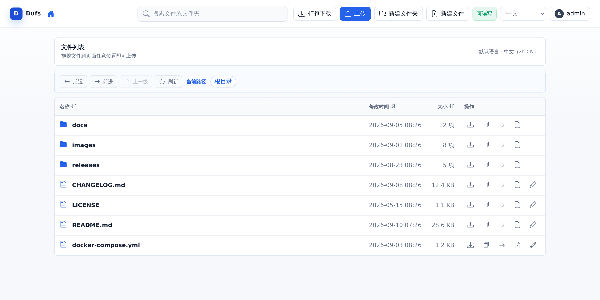
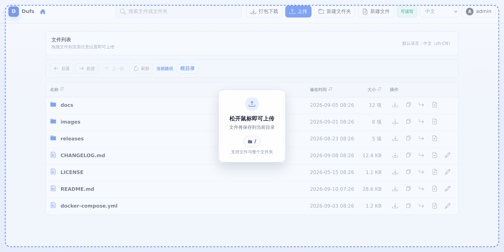
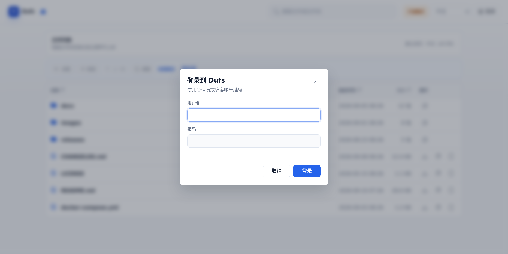
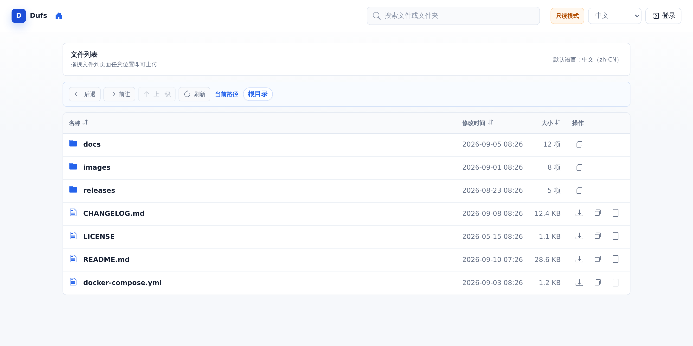
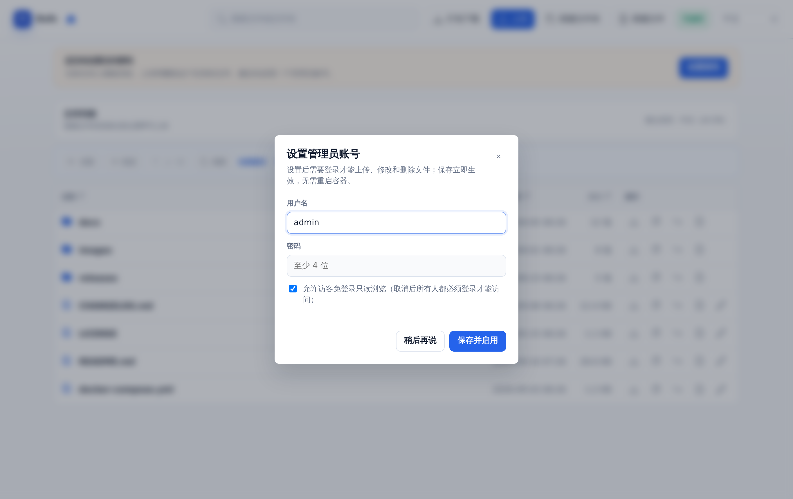
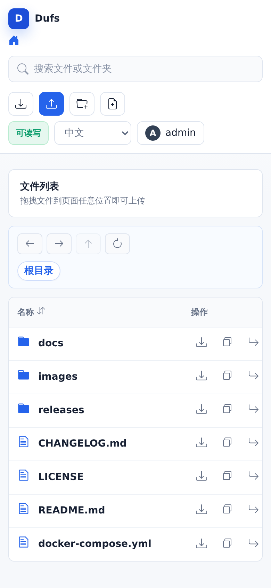

<div align="center">
  
  <h1>Dufs 中文增强版</h1>
  <p>轻量级网页文件管理器与 WebDAV 服务器 · 中文优先界面</p>
  <p>基于 <a href="https://github.com/sigoden/dufs">sigoden/dufs</a> 二次开发，单文件静态二进制、零运行时依赖，Docker 一条命令即可运行。</p>
  <p>
    
    
    
    
  </p>
  <p>
    
    
    
    
    
  </p>
</div>

## 项目简介

Dufs 可以把任意目录变成一个网页文件服务器：浏览器里直接浏览、上传、搜索、编辑、打包下载，也可以作为 WebDAV 网盘挂载到系统里使用。

本仓库是 Dufs 的中文增强版，在官方 `0.46.0` 的基础上重做了整套中文优先界面，并补充了拖拽上传提示层等交互细节。程序编译为单个静态二进制，镜像体积仅约 `9.7 MB`，没有运行时依赖，非常适合放进家庭 NAS、内网服务器或随身小主机。

## 界面预览

<table>
  <tr>
    <td align="center"><strong>文件列表</strong><br></td>
    <td align="center"><strong>拖拽上传提示</strong><br></td>
    <td align="center"><strong>登录</strong><br></td>
  </tr>
  <tr>
    <td align="center"><strong>访客只读视图</strong><br></td>
    <td align="center"><strong>首次设置访问密码</strong><br></td>
    <td align="center"><strong>移动端</strong><br></td>
  </tr>
</table>

## 与上游的差异

| 项目 | 上游 dufs | 本仓库 |
| --- | --- | --- |
| 界面语言 | 英文 | 中文优先，可切换中 / 英 |
| 界面风格 | 原生简洁 | 重新设计：卡片式布局、顶部工具栏、路径导航、权限状态徽章 |
| 拖拽上传 | 支持，无视觉反馈 | 支持，拖入页面时显示全屏范围提示层，并标明目标目录 |
| 交互细节 | — | 登录弹窗、复制访问链接、编辑器工具栏、Toast 提示、移动端重排 |
| 账号设置 | 只能用 `-a` 参数或配置文件 | 额外支持**网页首次初始化**：未配置账号时页面提示设置密码，写盘后立即生效 |
| 分发方式 | GitHub Release 二进制 | 额外提供多架构 Docker 镜像（`linux/amd64`、`linux/arm64`） |

## 功能特性

- 静态文件浏览和下载
- 文件夹打包为 zip 下载
- 上传文件和文件夹，支持拖拽上传（拖入页面时显示范围提示与目标目录）
- 创建、编辑、搜索文件
- 断点上传和断点下载
- 账号访问控制，支持网页首次初始化管理员账号（无需改启动参数）
- HTTPS 支持
- WebDAV 支持
- 可通过 Docker、二进制文件或 Cargo 安装

## Docker 快速开始

只读共享当前目录：

```sh
docker run --rm -p 5000:5000 -v "$PWD:/data" tannic666/dufs:latest /data
```

启用上传、删除、搜索、目录打包下载和文件编辑：

```sh
docker run --rm -p 5000:5000 -v "$PWD:/data" tannic666/dufs:latest /data -A
```

启用登录账号：

```sh
docker run --rm -p 5000:5000 -v "$PWD:/data" tannic666/dufs:latest /data \
  -A \
  -a admin:admin@/:rw \
  -a guest:guest@/
```

打开浏览器访问：

```text
http://127.0.0.1:5000/
```

示例账号：

```text
admin / admin
guest / guest
```

### 首次访问：在网页上设置密码（推荐）

容器启动后如果没有通过 `-a` 指定任何账号，页面顶部会出现提示条，点「设置密码」就能创建管理员账号：

- 自定义用户名与密码，密码以 **sha-512 哈希**保存到数据目录的 `.dufs-admin.json`
- 可勾选「允许访客免登录只读浏览」，取消勾选则所有人都必须登录才能访问
- 保存后**立即生效，无需重启容器**，之后初始化入口自动关闭（再次访问返回 403）
- 命令行 `-a` / 配置文件优先级更高，配置过就不会再出现设置提示

> 公网环境建议**先设置密码，再对外映射端口**。

### 默认启动参数

镜像内置 `CMD ["/data", "-A"]`，即**默认服务 `/data` 目录并开启上传、删除、搜索和打包下载**。因此在 NAS / Docker 面板里创建容器时：

- **端口（5000）与存储映射（`/data`）会被面板自动识别**，无需手填
- **命令栏可以留空**，启动后即可上传与拖拽文件
- 页面顶部会出现「设置密码」提示，点一下就能创建管理员账号（保存立即生效）
- 只想做**只读分享**时，把命令改为 `/data` 覆盖默认值即可

## 镜像标签

- `tannic666/dufs:latest`
- `tannic666/dufs:v1.0.0`

支持架构：

- `linux/amd64`
- `linux/arm64`

## 安装方式

### Cargo

```sh
cargo install dufs
```

### Homebrew

```sh
brew install dufs
```

### 二进制文件

可以从 GitHub Releases 下载 macOS、Linux、Windows 对应平台的二进制文件，解压后将 `dufs` 加入 `PATH`。

## CLI 用法

```text
Dufs is a distinctive utility file server - https://github.com/JunWan666/dufs

Usage: dufs [OPTIONS] [serve-path]

Arguments:
  [serve-path]  指定要提供服务的路径，默认当前目录

Options:
  -c, --config <file>        指定配置文件
  -b, --bind <addrs>         指定监听地址或 Unix socket
  -p, --port <port>          指定监听端口，默认 5000
      --path-prefix <path>   指定 URL 路径前缀
      --hidden <value>       在目录列表中隐藏匹配路径，例如 tmp,*.log,*.lock
  -a, --auth <rules>         添加认证规则，例如 user:pass@/dir1:rw,/dir2
  -A, --allow-all            允许所有操作
      --allow-upload         允许上传文件和文件夹
      --allow-delete         允许删除文件和文件夹
      --allow-search         允许搜索文件和文件夹
      --allow-symlink        允许访问根目录之外的符号链接
      --allow-archive        允许将文件夹打包下载
      --allow-hash           允许通过 ?hash 查询文件 sha256
      --enable-cors          启用 CORS，设置 Access-Control-Allow-Origin: *
      --render-index         访问目录时返回 index.html，不存在则返回 404
      --render-try-index     访问目录时优先返回 index.html，不存在则返回目录列表
      --render-spa           启用单页应用 fallback
      --assets <path>        指定自定义前端资源目录
      --log-format <format>  自定义 HTTP 日志格式
      --log-file <file>      指定日志文件，默认输出到 stdout/stderr
      --compress <level>     设置 zip 压缩等级，默认 low
      --completions <shell>  输出 shell 补全脚本
      --tls-cert <path>      HTTPS 证书路径
      --tls-key <path>       HTTPS 私钥路径
  -h, --help                 打印帮助
  -V, --version              打印版本
```

## 常用示例

以只读模式共享当前目录：

```sh
dufs
```

允许上传、删除、搜索、创建和编辑等操作：

```sh
dufs -A
```

只允许上传：

```sh
dufs --allow-upload
```

共享指定目录：

```sh
dufs Downloads
```

共享单个文件：

```sh
dufs linux-distro.iso
```

服务单页应用：

```sh
dufs --render-spa
```

服务带 `index.html` 的静态网站：

```sh
dufs --render-index
```

要求用户名和密码：

```sh
dufs -a admin:123@/:rw
```

监听指定地址和端口：

```sh
dufs -b 127.0.0.1 -p 80
```

监听 Unix socket：

```sh
dufs -b /tmp/dufs.socket
```

启用 HTTPS：

```sh
dufs --tls-cert my.crt --tls-key my.key
```

## HTTP API

上传文件：

```sh
curl -T path-to-file http://127.0.0.1:5000/new-path/path-to-file
```

下载文件或获取文件哈希：

```sh
curl http://127.0.0.1:5000/path-to-file
curl http://127.0.0.1:5000/path-to-file?hash
```

将文件夹下载为 zip：

```sh
curl -o path-to-folder.zip http://127.0.0.1:5000/path-to-folder?zip
```

删除文件或文件夹：

```sh
curl -X DELETE http://127.0.0.1:5000/path-to-file-or-folder
```

创建目录：

```sh
curl -X MKCOL http://127.0.0.1:5000/path-to-folder
```

移动文件或文件夹：

```sh
curl -X MOVE http://127.0.0.1:5000/path -H "Destination: http://127.0.0.1:5000/new-path"
```

列出或搜索目录内容：

```sh
curl http://127.0.0.1:5000?q=Dockerfile
curl http://127.0.0.1:5000?simple
curl http://127.0.0.1:5000?json
```

携带认证信息访问：

```sh
curl http://127.0.0.1:5000/file --user user:pass
curl http://127.0.0.1:5000/file --user user:pass --digest
```

断点下载：

```sh
curl -C- -o file http://127.0.0.1:5000/file
```

断点上传：

```sh
upload_offset=$(curl -I -s http://127.0.0.1:5000/file | tr -d '\r' | sed -n 's/content-length: //p')
dd skip=$upload_offset if=file status=none ibs=1 | \
  curl -X PATCH -H "X-Update-Range: append" --data-binary @- http://127.0.0.1:5000/file
```

健康检查：

```sh
curl http://127.0.0.1:5000/__dufs__/health
```

预期响应：

```json
{"status":"OK"}
```

<details>
<summary><h2>高级配置</h2></summary>

### 访问控制

Dufs 支持基于账号的访问控制，可以通过 `--auth` 或 `-a` 控制账号、路径和读写权限。

```sh
dufs -a admin:admin@/:rw -a guest:guest@/
dufs -a user:pass@/:rw,/dir1 -a @/
```

规则说明：

1. 使用 `@` 分隔账号和路径，没有账号表示匿名用户。
2. 使用 `:` 分隔用户名和密码。
3. 使用 `,` 分隔多个路径。
4. 使用路径后缀 `:rw` 或 `:ro` 设置读写或只读权限，`:ro` 可以省略。

示例：

- `-a admin:admin@/:rw`：`admin` 对所有路径拥有完整权限。
- `-a guest:guest@/`：`guest` 对所有路径只有只读权限。
- `-a user:pass@/:rw,/dir1`：`user` 对 `/*` 拥有读写权限，对 `/dir1/*` 只有只读权限。
- `-a @/`：所有路径允许匿名访问，任何人都可以查看和下载。

认证权限仍然受 Dufs 全局权限限制。例如没有通过 `--allow-upload` 启用上传时，即使账号拥有 `:rw` 权限，也不能上传文件。

### 哈希密码

Dufs 支持 sha-512 哈希密码。

生成哈希密码：

```sh
openssl passwd -6 123456
```

使用哈希密码：

```sh
dufs -a 'admin:$6$tWMB51u6Kb2ui3wd$5gVHP92V9kZcMwQeKTjyTRgySsYJu471Jb1I6iHQ8iZ6s07GgCIO69KcPBRuwPE5tDq05xMAzye0NxVKuJdYs/@/:rw'
```

注意：

- Dufs 仅支持 sha-512 哈希密码，密码字符串需要以 `$6$` 开头。
- 哈希密码中包含 `$6`，在部分 shell 中会被当作变量展开，建议使用单引号包裹。
- Digest 认证无法正常配合哈希密码使用。

### 隐藏路径

通过 `--hidden <glob>,...` 可以从目录列表中隐藏指定名称。

```sh
dufs --hidden .git,.DS_Store,tmp
dufs --hidden '.*'
dufs --hidden '*/'
dufs --hidden '*.log,*.lock'
dufs --hidden '*.log' --hidden '*.lock'
```

`--hidden` 使用的 glob 只匹配文件名或目录名，不匹配完整路径，因此 `--hidden dir1/file` 无效。

### 日志格式

通过 `--log-format` 可以自定义 HTTP 日志格式。

可用变量：

| 变量 | 说明 |
| --- | --- |
| `$remote_addr` | 客户端地址 |
| `$remote_user` | 认证用户名 |
| `$request` | 原始请求行 |
| `$status` | 响应状态码 |
| `$http_` | 任意请求头，例如 `$http_user_agent`、`$http_referer` |

默认日志格式：

```text
$time_iso8601 $log_level - $remote_addr "$request" $status
```

JSON 日志格式示例：

```sh
dufs --log-format '{"time":"$time_local","addr":"$remote_addr","uri":"$request_uri","method":"$request_method","status":$status}'
```

关闭 HTTP 日志：

```sh
dufs --log-format=''
```

### 环境变量

所有选项都可以通过 `DUFS_` 前缀的环境变量设置。

```text
[serve-path]                DUFS_SERVE_PATH="."
    --config <file>         DUFS_CONFIG=config.yaml
-b, --bind <addrs>          DUFS_BIND=0.0.0.0
-p, --port <port>           DUFS_PORT=5000
    --path-prefix <path>    DUFS_PATH_PREFIX=/dufs
    --hidden <value>        DUFS_HIDDEN=tmp,*.log,*.lock
-a, --auth <rules>          DUFS_AUTH="admin:admin@/:rw|@/"
-A, --allow-all             DUFS_ALLOW_ALL=true
    --allow-upload          DUFS_ALLOW_UPLOAD=true
    --allow-delete          DUFS_ALLOW_DELETE=true
    --allow-search          DUFS_ALLOW_SEARCH=true
    --allow-symlink         DUFS_ALLOW_SYMLINK=true
    --allow-archive         DUFS_ALLOW_ARCHIVE=true
    --allow-hash            DUFS_ALLOW_HASH=true
    --enable-cors           DUFS_ENABLE_CORS=true
    --render-index          DUFS_RENDER_INDEX=true
    --render-try-index      DUFS_RENDER_TRY_INDEX=true
    --render-spa            DUFS_RENDER_SPA=true
    --assets <path>         DUFS_ASSETS=./assets
    --log-format <format>   DUFS_LOG_FORMAT=""
    --log-file <file>       DUFS_LOG_FILE=./dufs.log
    --compress <compress>   DUFS_COMPRESS=low
    --tls-cert <path>       DUFS_TLS_CERT=cert.pem
    --tls-key <path>        DUFS_TLS_KEY=key.pem
```

### 配置文件

可以通过 `--config <path-to-config.yaml>` 指定配置文件。

```yaml
serve-path: '.'
bind: 0.0.0.0
port: 5000
path-prefix: /dufs
hidden:
  - tmp
  - '*.log'
  - '*.lock'
auth:
  - admin:admin@/:rw
  - user:pass@/src:rw,/share
  - '@/'
allow-all: false
allow-upload: true
allow-delete: true
allow-search: true
allow-symlink: true
allow-archive: true
allow-hash: true
enable-cors: true
render-index: true
render-try-index: true
render-spa: true
assets: ./assets/
log-format: '$remote_addr "$request" $status $http_user_agent'
log-file: ./dufs.log
compress: low
tls-cert: tests/data/cert.pem
tls-key: tests/data/key_pkcs1.pem
```

### 自定义 UI

Dufs 支持通过自己的前端资源目录自定义 UI。

```sh
dufs --assets my-assets-dir/
```

自定义资源目录必须包含 `index.html` 文件。

`index.html` 可以使用以下占位变量读取内部数据：

- `__INDEX_DATA__`：目录列表数据
- `__ASSETS_PREFIX__`：前端资源 URL 前缀

也支持自定义 `404.html` 页面。

</details>

## 致谢

- 上游项目：[sigoden/dufs](https://github.com/sigoden/dufs)。本仓库基于其 `0.46.0` 版本二次开发，感谢原作者与所有贡献者。
- 界面文案、图标与交互沿用上游的 MIT / Apache-2.0 授权，二次开发的部分同样遵循该授权。
- 本项目的中文界面、拖拽上传提示层等改动由 [@JunWan666](https://github.com/JunWan666) 维护。

## 许可证

Copyright (c) 2022-2024 dufs-developers.

Dufs 可以在 MIT License 或 Apache License 2.0 中任选其一使用。

许可证详情见 `LICENSE-APACHE` 和 `LICENSE-MIT`。
